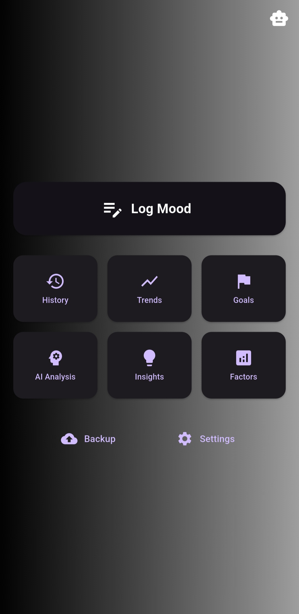
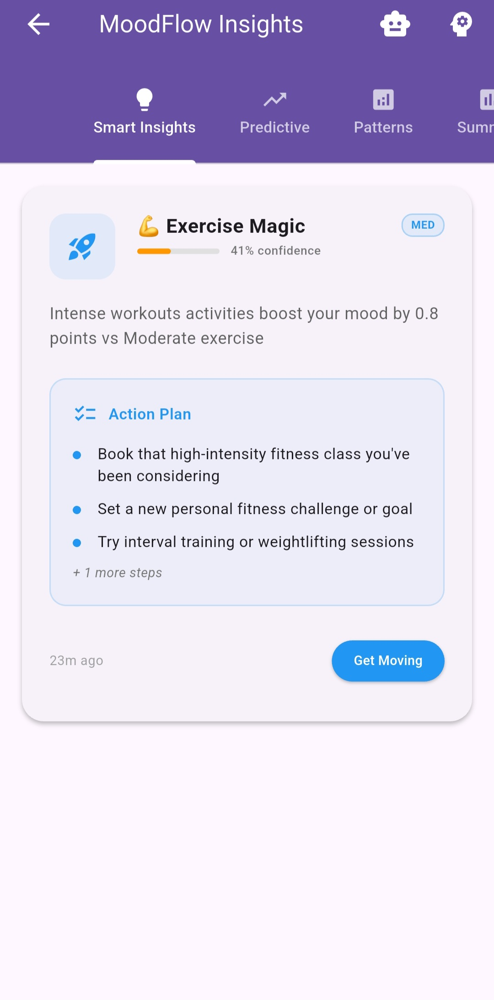
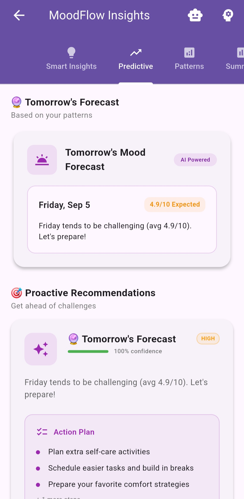
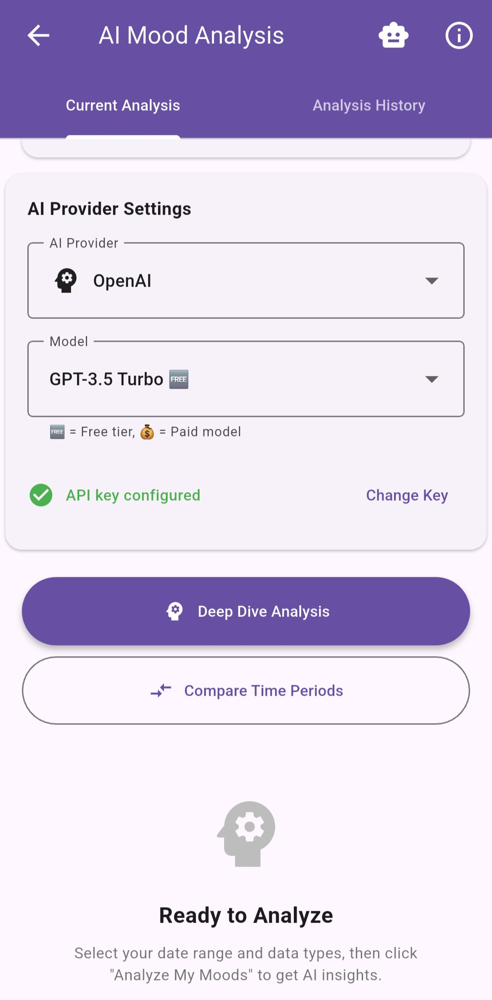
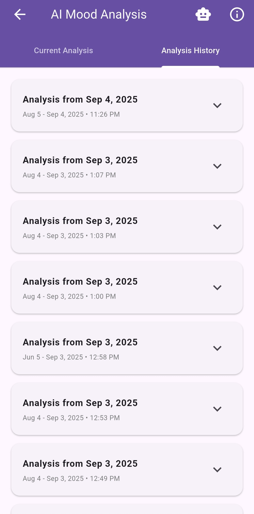
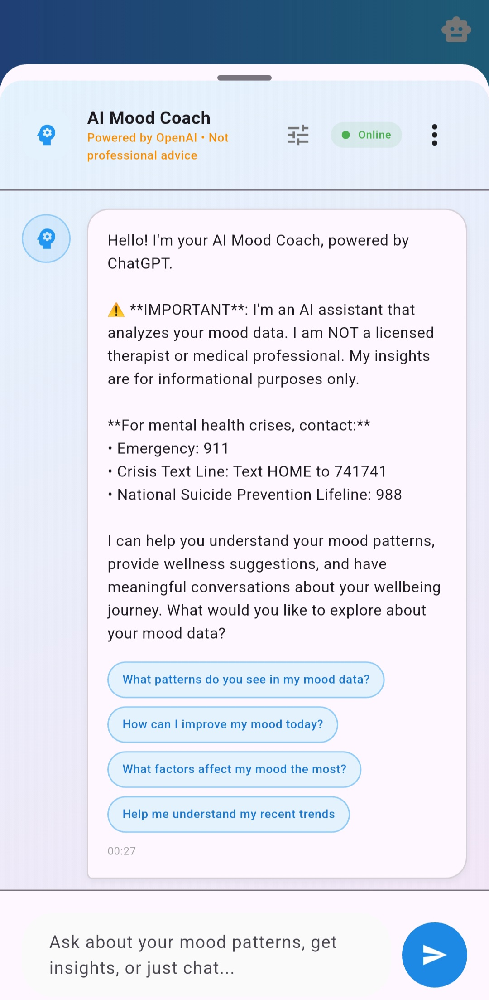
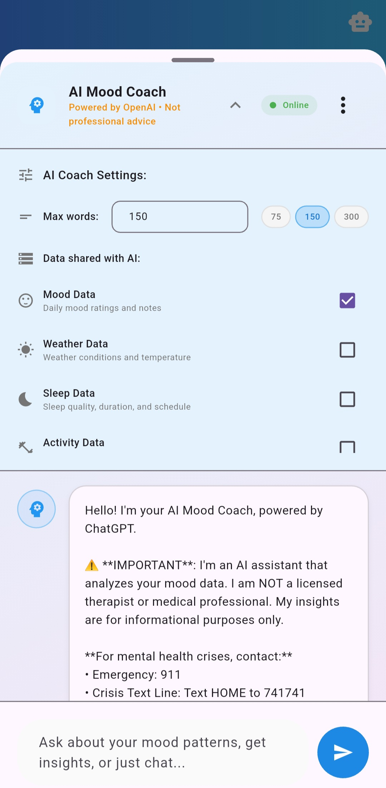
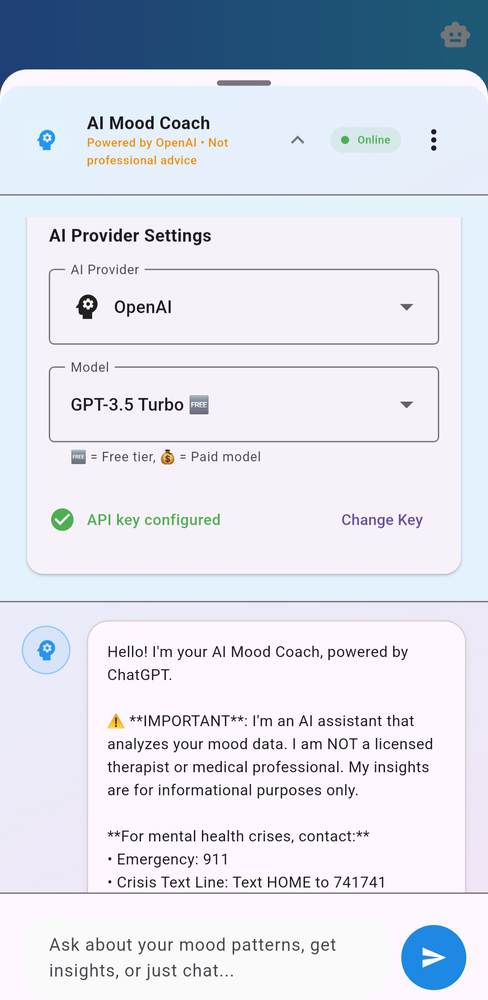
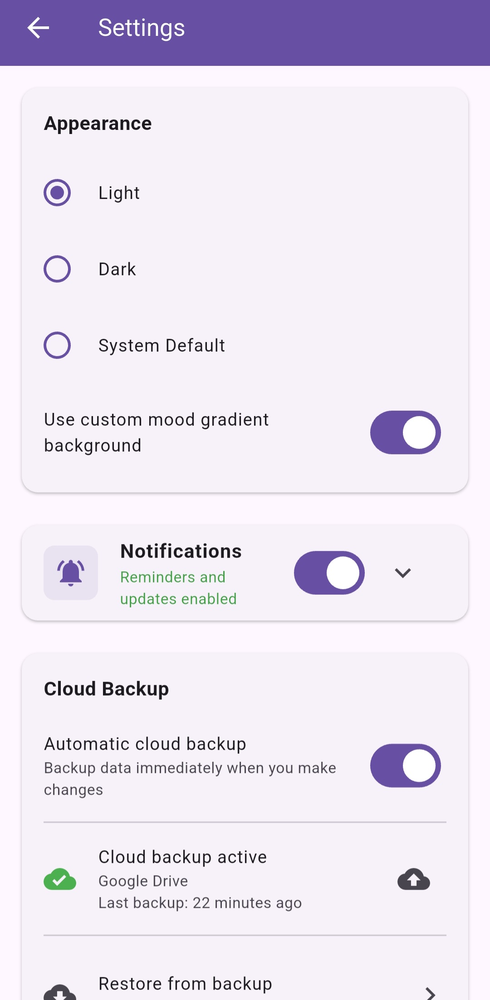
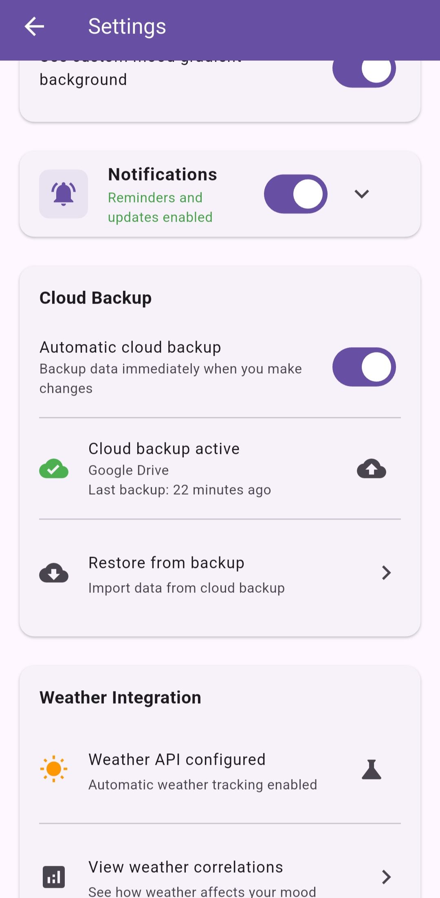

<div align="center">
  
</div>

# MoodFlow 🌟


[](https://github.com/wedrownyelite/MoodFlow/releases/latest)
[](LICENSE)
[](https://github.com/wedrownyelite/MoodFlow/issues)
[](https://flutter.dev)

## 📝 License

This project is licensed under the **MoodFlow License**.

**TL;DR:**
- ✅ Free for personal, educational, and research use
- ✅ Modification and redistribution allowed with attribution and inclusion of this license
- ❌ Commercial use prohibited
- ❌ Rebranding or publishing as a different app prohibited

See the full [LICENSE](LICENSE) file for complete terms.

# 🌟 Track. Understand. Improve. 🌟
MoodFlow is a **smart mood tracking app** that helps you:


* 🌅 Track your mood throughout the day (morning, midday, evening)
* 📊 Visualize trends with charts & insights
* 🤖 Get personalized advice with multi-provider AI analysis
* 🌤️ Plan your day with mood forecasting

## 📥 Get MoodFlow Now

[](https://github.com/wedrownyelite/MoodFlow/releases/latest)

## 🤔 Why MoodFlow?

* Quickly identify emotional patterns
* Plan your day using AI-powered insights from 14 different models
* Track lifestyle factors affecting your mood
* No ads, no hidden tracking — fully private

## 📱 Features

### Core Functionality

* 🌞 **Morning, Midday, Evening Tracking** – Track moods in multiple segments
* 😃 **Visual Mood Rating** – Emoji-based 1–10 slider
* 📝 **Notes & Journaling** – Record thoughts and reflections
* 📈 **Trends & Analytics** – Charts, heatmaps, and streaks

### Smart Features

* 🔔 **Intelligent Notifications** – Context-aware reminders for mood logging
* 🎯 **Goal Setting & Tracking** – Personalized goals with progress monitoring
* ⏰ **Time-Based Access** – Morning, midday, evening logging unlocks
* 📊 **Statistics Dashboard** – Comprehensive insights including streaks and averages
* 🌗 **Dark/Light Mode** – Adaptive themes with gradient backgrounds

### Multi-Provider AI Analysis ✨

| Feature                | Description                                                        |
| ---------------------- | ------------------------------------------------------------------ |
| 14 AI Models           | Choose from OpenAI, Anthropic, Google, Mistral, and Meta models   |
| Personalized Insights  | AI analyzes your mood log notes for tailored recommendations       |
| Custom Action Plans    | Receive specific strategies to improve or stabilize your mood      |
| Seamless Switching     | Switch between AI providers and models instantly                   |
| Cost Flexibility       | Select from budget-friendly to premium AI options                 |

#### Available AI Models:
- **OpenAI**: GPT-4o, GPT-4o Mini, GPT-3.5 Turbo
- **Anthropic**: Claude 3.5 Sonnet, Claude 3 Haiku
- **Google**: Gemini 1.5 Pro, Gemini 1.5 Flash
- **Mistral**: Mistral Large, Medium, Small
- **Meta/Perplexity**: Llama 3.1 Sonar Large/Small, Llama 3.1 70B
- **Mixtral**: Mixtral 8x7B

### Correlations & Insights 🔎

* ☀️ **Weather Integration** – Auto-fetch weather data
* 💤 **Sleep Tracking** – Monitor sleep quality and duration
* 🏃 **Activity Monitoring** – Track exercise and social activities
* 💼 **Lifestyle Factors** – Log work stress, custom tags, notes
* 📈 **Smart Analytics** – Discover correlations between factors and mood
* 📅 **Pattern Recognition** – Weekly trends, time-of-day patterns

### Forecast & AI Coach 🌤️🧑‍🏫

| Feature       | Description                                                     |
| ------------- | --------------------------------------------------------------- |
| Mood Forecast | Predict tomorrow's probable mood & planning tips                |
| AI Coach      | Chat with AI using your mood logs, sleep, weather & stress data |
| Customization | Control max response length and choose shared data              |

> 💡 **Tip:** Use AI Coach to reflect on patterns and plan a better day!

### User Experience

* 🎨 **Blur Transitions** – Smooth navigation animations
* 📱 **Responsive Design** – Optimized for all screen sizes
* 💾 **Offline Support** – Local data storage
* ✍️ **Manual Entry** – Add historical mood data

## 🛠️ Technology Stack

* **Framework**: Flutter 3.8.1+
* **Language**: Dart
* **Local Storage**: SharedPreferences
* **Notifications**: Flutter Local Notifications
* **Date/Time**: Intl package
* **Permissions**: Permission Handler
* **AI Integration**: Multi-provider API support
* **Architecture**: Service-oriented

<details>
<summary>📦 Installation & Setup 📦 ─────────</summary>

### Prerequisites

* Flutter SDK 3.8.1+
* Dart SDK
* Android Studio / VS Code
* Android SDK (for Android)
* Xcode (for iOS)

### Setup

```bash
git clone https://github.com/wedrownyelite/MoodFlow.git
cd moodflow
flutter pub get
flutter run
```

#### Android

* Minimum SDK: 21
* Target SDK: Latest

#### iOS

* Minimum iOS: 12.0
* Background refresh recommended

</details>

<details>
<summary>🌟 Daily Mood Tracking 🌟 ─────────</summary>

```
lib/
├── main.dart
├── screens/
├── services/
├── widgets/
└── [additional files]
```

</details>

## 🎯 Usage

<details>
<summary>Daily Mood Tracking</summary>

1. Morning: Log starting mood
2. Midday: Check-in
3. Evening: Reflect on your day

</details>

<details>
<summary>Setting Goals</summary>
- Navigate to Goals screen
- Choose preset or custom goals
- Track progress with notifications
</details>

<details>
<summary>Viewing Trends</summary>
- Charts and statistics
- Mood patterns over time
- Peak emotional times and streaks
</details>

<details>
<summary>AI Analysis</summary>
- Choose from 14 AI models across 5 providers
- Get personalized action plans based on your mood logs
- Switch between models for different analysis styles
- Specify date ranges for targeted insights
</details>

## 🔧 Configuration

<details>
<summary>Notifications & Themes</summary>
- Custom reminders and alerts
- Light/Dark Mode with gradients
</details>

<details>
<summary>AI Model Selection</summary>
- Select preferred AI provider and model
- Balance between speed and analysis depth
- Configure API keys for different providers
</details>

## 📊 Data & Privacy

* 💾 Local Storage (SharedPreferences)
* ☁️ Optional Cloud Sync (iCloud/Google Cloud)
* ❌ No analytics tracking
* 🔄 Export/Import available
* 🔒 AI analysis uses your own API keys for maximum privacy

## 📸 Screenshots

### Main App Flow

| Home                          | Mood Logging                        | Dark Mode                          |
| ----------------------------- | ----------------------------------- | ---------------------------------- |
|  |  |  |

### Daily Factors

| Sleep                                        | Weather                                          | Activity                                           | Work Stress                                         |
| -------------------------------------------- | ------------------------------------------------ | -------------------------------------------------- | --------------------------------------------------- |
|  |  |  |  |

### Insights

| Insights Overview                                       | Mood Forecast                                       | Correlation Patterns                                   | Insights Summary                                      |
| ------------------------------------------------------- | --------------------------------------------------- | ------------------------------------------------------ | ----------------------------------------------------- |
|  |  |  |  |

### Trends & Analytics

| Overview                           | Detailed                             |
| ---------------------------------- | ------------------------------------ |
|  |  |

### AI Analysis

| Main Interface & Data Selection           | Provider & Generation                              | History                                           | Disclaimer                                         |
| ----------------------------------------- | -------------------------------------------------- | ------------------------------------------------- | -------------------------------------------------- |
|  |  |  |  |

### AI Coach

| Main Interface                            | Data Settings                                      | Provider Settings                                 |
| ----------------------------------------- | -------------------------------------------------- | ------------------------------------------------- |
|  |  |  |

### Backup & Export

| Export                            | Cloud Backup                                 | Restore                             |
| --------------------------------- | -------------------------------------------- | ----------------------------------- |
|  |  |  |

### Goals & Progress

| Dashboard                        | Details                            |
| -------------------------------- | ---------------------------------- |
|  |  |

### Settings & Customization

| Themes                               | Backup                                    | Notifications                          |
| ------------------------------------ | ----------------------------------------- | -------------------------------------- |
|  |  |  |

## 🙏 Acknowledgments

* Flutter team for the amazing framework
* OpenAI, Anthropic, Google, Mistral, and Meta for AI model access

---

<div align="center">
<p>Made with ❤️ and Flutter</p>
<p>
<a href="#top">Back to Top</a> • <a href="https://github.com/wedrownyelite/moodflow/issues">Report Bug</a> • <a href="https://github.com/wedrownyelite/moodflow/issues">Request Feature</a>
</p>
</div>