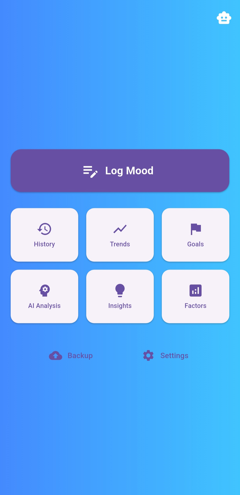
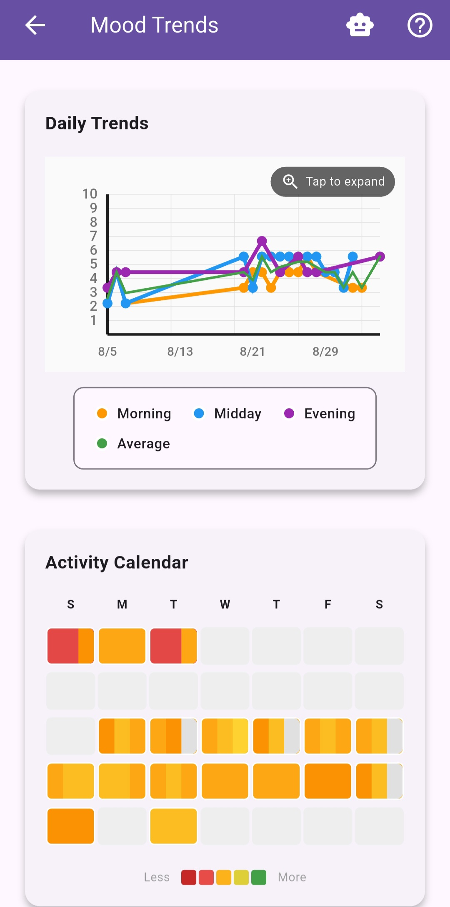

# MoodFlow 🌟

A comprehensive mood tracking application built with Flutter, designed to help users monitor their emotional wellbeing throughout the day with intelligent insights and goal tracking.

## 📱 Features

### Core Functionality
- **Multi-Segment Daily Tracking** - Track your mood during morning, midday, and evening periods
- **Visual Mood Rating** - Intuitive 1-10 scale with emoji feedback and smooth animations
- **Rich Note-Taking** - Add detailed notes and thoughts for each mood entry
- **Historical View** - Browse and edit past mood entries with monthly navigation
- **Trend Analysis** - Visualize mood patterns with interactive charts and heatmaps

### Smart Features
- **Intelligent Notifications** - Context-aware reminders for mood logging
- **Goal Setting & Tracking** - Set personalized mood goals with progress monitoring
- **Time-Based Access** - Morning, midday, and evening logging unlocks throughout the day
- **Statistics Dashboard** - Comprehensive insights including streaks, averages, and patterns
- **Dark/Light Mode** - Adaptive themes with custom gradient backgrounds

### User Experience
- **Blur Transitions** - Smooth, professional navigation animations
- **Responsive Design** - Optimized for all screen sizes and orientations
- **Offline Support** - Local data storage with SharedPreferences
- **Manual Entry** - Add historical mood data for missed days

## 🛠️ Technology Stack

- **Framework**: Flutter 3.8.1+
- **Language**: Dart
- **Local Storage**: SharedPreferences
- **Notifications**: Flutter Local Notifications
- **Date/Time**: Intl package for internationalization
- **Permissions**: Permission Handler
- **Architecture**: Service-oriented with separation of concerns

## 📦 Installation

### Prerequisites
- Flutter SDK (3.8.1 or higher)
- Dart SDK
- Android Studio / VS Code
- Android SDK (for Android development)
- Xcode (for iOS development, macOS only)

### Setup
1. Clone the repository:
```bash
git clone https://github.com/yourusername/moodflow.git
cd moodflow
```

2. Install dependencies:
```bash
flutter pub get
```

3. Run the app:
```bash
flutter run
```

### Platform-Specific Setup

#### Android
- Minimum SDK: 21 (Android 5.0)
- Target SDK: Latest
- Notification permissions are handled automatically

#### iOS
- Minimum iOS: 12.0
- Notification permissions requested on first launch
- Background app refresh recommended for notifications

## 🏗️ Project Structure

```
lib/
├── main.dart                 # App entry point
├── screens/                  # UI screens
│   ├── main_menu_screen.dart
│   ├── mood_log_screen.dart
│   ├── mood_history_screen.dart
│   ├── mood_trends_screen.dart
│   ├── goals_screen.dart
│   └── settings_screen.dart
├── services/                 # Business logic
│   ├── animation/           # Animation services
│   ├── data/               # Data management
│   └── ui/                 # UI utilities
├── widgets/                 # Reusable components
│   ├── animated_mood_slider.dart
│   ├── mood_line_chart.dart
│   ├── mood_heatmap.dart
│   └── goal_card.dart
└── [additional files]
```

## 🎯 Usage

### Daily Mood Tracking
1. **Morning** (Available from 12:00 AM): Log your starting mood and thoughts
2. **Midday** (Available from 12:00 PM): Check in during your day
3. **Evening** (Available from 6:00 PM): Reflect on your day's emotional journey

### Setting Goals
- Navigate to the Goals screen
- Choose from preset goal types or create custom goals
- Track progress with visual indicators
- Receive notifications for goal milestones

### Viewing Trends
- Access comprehensive charts and statistics
- View mood patterns over different time periods
- Identify your peak emotional times of day
- Track logging streaks and consistency

## 🔧 Configuration

### Notifications
Customize notification preferences in Settings:
- Morning, midday, and evening reminders
- End-of-day completion notifications
- Goal progress updates
- Streak celebration alerts

### Themes
- **Light Mode**: Clean, bright interface
- **Dark Mode**: Easy on the eyes for evening use
- **Custom Gradients**: Dynamic backgrounds based on mood data

## 🧪 Testing

Run tests with:
```bash
flutter test
```

For integration tests:
```bash
flutter test integration_test
```

## 📊 Data & Privacy

- **Local Storage**: All data stored locally on device using SharedPreferences
- **No Cloud Sync**: Your mood data never leaves your device
- **No Analytics**: No user tracking or data collection
- **Export/Import**: Manual backup through device storage access

## 🤝 Contributing

We welcome contributions! Please follow these steps:

1. Fork the repository
2. Create a feature branch (`git checkout -b feature/<feature-name>`)
3. Commit your changes (`git commit -m 'Added a feature hehe'`)
4. Push to the branch (`git push origin feature/<feature-name>`)
5. Open a Pull Request

### Development Guidelines
- Follow Dart/Flutter best practices
- Maintain consistent code formatting
- Add tests for new features
- Update documentation as needed

## 📝 License

This project is licensed under the MIT License - see the [LICENSE](LICENSE) file for details.

## 🐛 Bug Reports & Feature Requests

Please use the [GitHub Issues](https://github.com/wedrownyelite/moodflow/issues) page to:
- Report bugs with detailed reproduction steps
- Request new features with clear use cases
- Discuss improvements and suggestions

## 📞 Support

For support and questions:
- 📧 Email: oddologyinc@gmail.com
- 💬 Discussions: Use GitHub Discussions for community support

## 🗺️ Roadmap

### Upcoming Features
- [ ] Data export/import functionality
- [ ] Mood correlation with weather/activities
- [ ] Advanced statistical analysis
- [ ] Widget support for home screen
- [ ] Backup and sync options
- [ ] Accessibility improvements

### Long-term Goals
- [ ] Machine learning mood predictions
- [ ] Integration with health apps
- [ ] Multi-language support
- [ ] Web companion app
- [ ] Community features (optional)

## 📸 Screenshots

### Main App Flow
| Home Screen | Mood Logging | Dark Mode |
|-------------|--------------|-----------|
|  |  |  |

### Trends & Analytics
| Trends Overview | Detailed Analytics |
|-----------------|-------------------|
|  |  |

### Goals & Progress
| Goals Dashboard | Goal Details |
|-----------------|--------------|
|  |  |

### Settings & Customization
| Themes & Basic Notifications | Advanced Notifications | Notification Preferences |
|------------------------------|------------------------|--------------------------|
|  |  |  |

*Extensive notification customization with granular control over reminders, timing, and preferences*

## 🙏 Acknowledgments

- Flutter team for the amazing framework

---

<div align="center">
  <p>Made with ❤️ and Flutter</p>
  <p>
    <a href="#top">Back to Top</a> •
    <a href="https://github.com/wedrownyelite/moodflow/issues">Report Bug</a> •
    <a href="https://github.com/wedrownyelite/moodflow/issues">Request Feature</a>
  </p>
</div>
